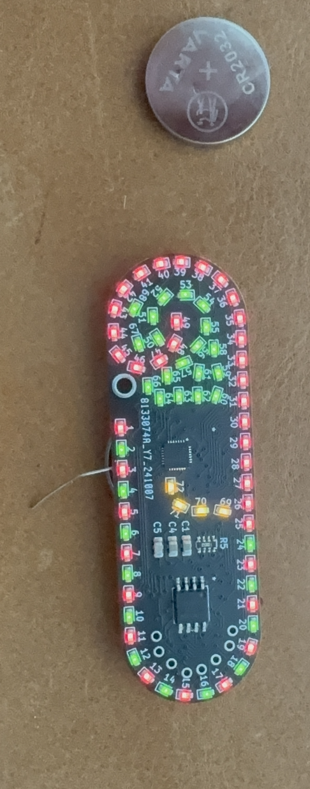

# led-board learning project
Files relating to led-board.
Not anywhere near recommending to use any of this for something. 

Using IS31FL3731 as a led driver to control all the leds individually. 
Using Attiny85 to control IS31FL3731 via i2c. 

Powered by cr2032 battery.
 
Almost copied from https://github.com/adafruit/Adafruit_IS31FL3731

# v0.x1
Which actually was multiple different boards.

# v.02

